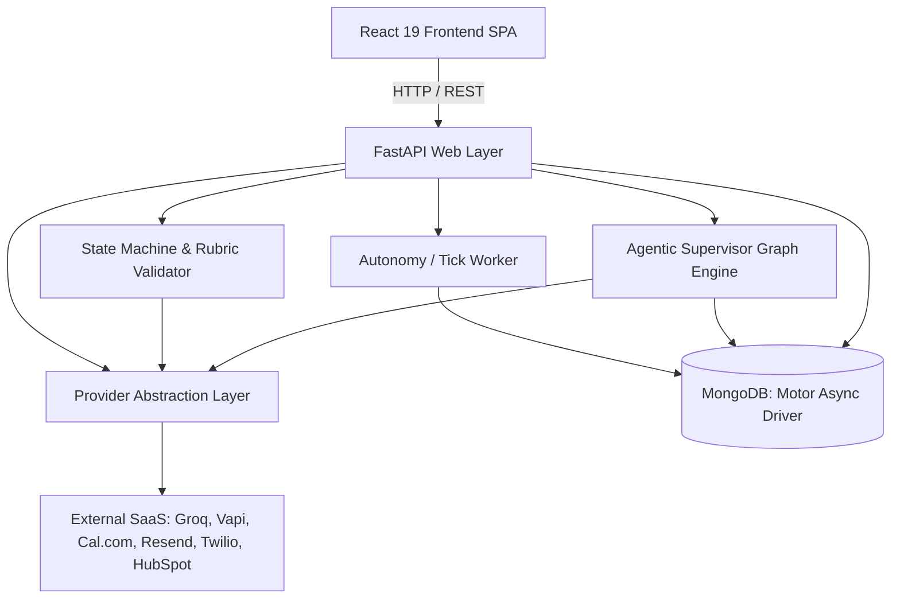

# Architecture

**Analysis Date:** 2026-09-09

## Pattern Overview

**Overall:** Full-Stack AI Lead Qualification & Autonomous Orchestration Platform.
EstateX pairs a high-concurrency async web tier (FastAPI + Motor) with a React single-page application and a dual-pipeline orchestration architecture:
1. **v1 Automation Pipeline:** Fast-path reactive pipeline using FastAPI `BackgroundTasks` coupled to a deterministic Finite State Machine (FSM).
2. **v2 Agentic Architecture:** LangGraph-style state graph engine (`agents/graph.py`) with supervisor decision-making, multi-agent specialization, MongoDB checkpointing, and human-in-the-loop interrupts.

**Core Architectural Invariant:**
> *"The agent proposes, the state machine enforces."*
> - **Probabilistic (Agent / LLM):** Information extraction, qualification reasoning, next-best-action selection, email/SMS drafting, and property enrichment.
> - **Deterministic (Python Guardrails):** State machine transitions, rubric qualification scoring (0–100), CRM mutations, calendar booking commits, quiet-hours gating, and opt-out rules.

## Layers

### 1. Presentation Layer (`frontend/src/`)
- **Purpose:** Provide an intuitive, real-time command center for brokers and team leads to monitor lead progression, inspect AI qualifications, review event audit trails, approve escalations, and observe integration health.
- **Key Modules:**
  - `pages/Dashboard.jsx`: Kanban board visualizing leads across pipeline states (`NEW`, `CALLING`, `IN_CONVERSATION`, `QUALIFIED`, `HOT`, `NURTURE`, `BOOKED`).
  - `pages/LeadDetail.jsx`: Comprehensive lead breakdown showing contact details, qualification rubric scores, call audio/transcript, event timeline, scheduled tasks, and live action buttons.
  - `pages/Landing.jsx` & `pages/Capture.jsx`: Public marketing landing page and high-converting lead capture form.
  - `pages/Analytics.jsx`: Recharts-powered funnel conversions, response times, and pipeline velocity metrics.
  - `pages/Compare.jsx`: Side-by-side inspection contrasting V1 deterministic automation against V2 agentic supervisor workflows.
  - `components/ProviderStatus.jsx`: Real-time status indicators reflecting the operational state of external services.

### 2. API & Routing Layer (`backend/server.py`)
- **Purpose:** Expose RESTful endpoints, validate request payloads, enforce authentication and rate limiting, and delegate business operations.
- **Responsibilities:**
  - Route declarations (`/api/lead`, `/api/leads/*`, `/api/providers`, `/api/webhooks/*`, `/api/tick`).
  - Request rate-limiting via in-memory sliding window limiter (`_rate_limiter`).
  - Security gates (`require_admin` utilizing `secrets.compare_digest`).
  - Dispatching background tasks for non-blocking I/O.

### 3. State Machine & Scoring Layer (`backend/server.py`)
- **Purpose:** Guarantee data integrity, enforce legal lifecycle transitions, and compute objective qualification scores.
- **Allowed Transitions (`ALLOWED_TRANSITIONS`):**
  - `NEW` ➔ `CALLING`
  - `CALLING` ➔ `IN_CONVERSATION`, `NEW` (retry on failure)
  - `IN_CONVERSATION` ➔ `QUALIFIED`, `HOT`, `NURTURE`
  - `QUALIFIED` ➔ `BOOKED`, `NURTURE`
  - `HOT` ➔ `BOOKED`, `NURTURE`
  - `NURTURE` ➔ `CALLING`, `QUALIFIED`
- **Rubric Scoring Engine (`compute_score`):**
  - Computes a deterministic integer score (0–100) based on extracted criteria: Timeline (0–30 pts), Budget alignment (0–25 pts), Financing pre-approval (0–25 pts), and Motivation/Clarity (0–20 pts).

### 4. Agentic Orchestration Layer (`backend/agents/`)
- **Purpose:** Autonomous next-best-action reasoning, memory persistence across sessions, and safe human handoff.
- **Key Modules:**
  - `graph.py` (`StateGraph`, `CompiledGraph`, `MongoCheckpointer`): A lightweight (139 lines), zero-dependency LangGraph reimplementation supporting conditional edges, loop safety, and checkpointed state hydration.
  - `supervisor.py`:
    - `supervisor_node`: Evaluates lead history and selects `next_action ∈ {call, enrich, follow_up, escalate, wait, done}`.
    - `enrichment_agent`: Produces personalized property highlights and neighbourhood context.
    - `followup_agent`: Drafts contextual outreach tailored by tone and urgency while respecting quiet-hours constraints.
    - `escalate`: Triggers an execution interrupt (`{_interrupt: True}`), parking the graph until an operator issues an `/approve` or `/reject` decision.

### 5. Integration & Provider Layer (`backend/providers.py`)
- **Purpose:** Encapsulate all third-party I/O interactions behind uniform contracts.
- **Key Abstractions:**
  - `ProviderResult`: Dataclass capturing `spec`, `provider`, `mode` (`LIVE` | `MOCK`), `ok`, `status`, `error`, and `data`.
  - `PROVIDER_SPECS`: Declarative registry mapping service capabilities to required environment variables and safety gates.
  - Pure functional design: Providers perform zero direct database operations; caller owns policy and auditing.

### 6. Persistence & Asynchronous Worker Layer (`backend/server.py`)
- **Purpose:** Scalable data storage, event sourcing, and reconciliation without heavy queue brokers like Celery or Redis.
- **Mechanism:**
  - All deferred operations (follow-up reminders, quiet-hour holds, retry sweeps) are recorded in `db.scheduled_actions`.
  - `POST /api/tick`: Idempotent worker endpoint claiming tasks atomically via `PENDING` ➔ `RUNNING` transitions.

## Data Flow

### 1. Inbound Lead Ingestion & Qualification Flow
1. Lead submitted via frontend form (`POST /api/lead`) or Google Ads webhook (`POST /api/webhooks/google-leads`).
2. Server validates payload via Pydantic (`LeadCaptureIn`), checks rate limits, and upserts lead record into MongoDB `leads` collection with status `NEW`.
3. Background task `run_ai_pipeline` is dispatched.
4. Voice provider (`Vapi` or mock) initiates call. Lead status moves to `CALLING`.
5. Upon call completion (or inbound webhook receipt at `/api/webhooks/vapi`), the full transcript is passed to `qualify_and_route`.
6. LLM extracts structured qualification dimensions (`timeline`, `budget`, `pre_approved`, `preferred_location`).
7. Deterministic rubric computes 0–100 score and classifies lead into `HOT`, `QUALIFIED`, or `NURTURE`.
8. State machine validates and records transition in `events` collection.
9. Contact and deal records are synced to HubSpot CRM.
10. Follow-up email or SMS is dispatched or scheduled via `scheduled_actions`.

### 2. Autonomous Tick & Reconciliation Flow (`/api/tick`)
1. External cron (GitHub Actions or scheduler) calls `POST /api/tick` with `ADMIN_TOKEN`.
2. Tick queries `scheduled_actions` for actions where `run_at <= now` and `state == "PENDING"`.
3. Claims records by updating state to `RUNNING` atomically.
4. Executes corresponding action (e.g. sending queued nurture email, triggering follow-up call).
5. Scans for leads stuck in `CALLING` status past `CALL_TIMEOUT_MINUTES` and resets them safely.
6. Scans for leads with arrived transcripts that missed scoring and triggers re-qualification.

### 3. Human-in-the-Loop Escalation Flow
1. Supervisor agent node evaluates high-value or complex lead and selects `next_action = "escalate"`.
2. Graph sets `_interrupt: True`, saves state checkpoint to `db.graph_checkpoints`, and pauses execution.
3. Lead Detail UI displays escalation banner with "Approve" and "Reject" controls.
4. Operator submits decision (`POST /api/leads/:id/approve` or `/reject`).
5. Graph resumes via `ainvoke(resume=True)` with human approval recorded in state, proceeding to completion.

---

*Architecture analysis: 2026-09-09*
*Update after major architectural restructuring*
