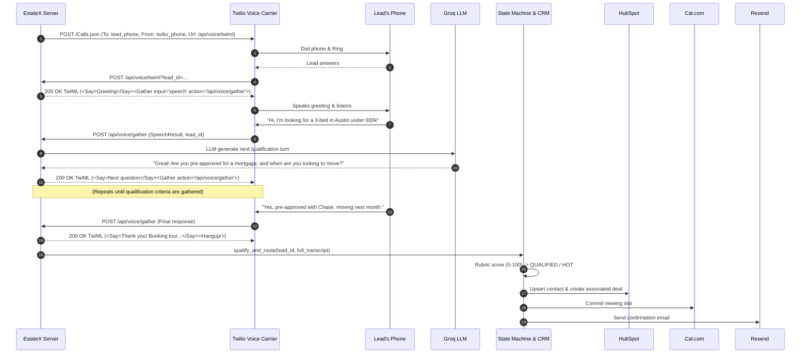

# Phase 1: Real Provider Live Readiness - Research

**Researched:** 2026-09-09
**Domain:** Telephony APIs (Twilio Voice/TwiML), Real-Time Conversational LLMs (Groq), Calendar Booking (Cal.com), Transactional Email (Resend), Messaging (Twilio SMS), CRM (HubSpot)
**Confidence:** HIGH

<user_constraints>
## User Constraints (from 01-CONTEXT.md)

### Locked Decisions
- **D-01 (Voice Telephony & Paywall Removal):** Replace proprietary Vapi dependency with direct **Twilio Voice + Groq LLM TwiML Speech Pipeline**.
  - Outbound call initiated via Twilio REST API (`/2010-04-01/Accounts/{sid}/Calls.json`).
  - Interactive speech turn loop using TwiML `<Gather input="speech">` and Amazon Polly TTS.
  - Spoken responses received at `/api/voice/gather`, processed in real time by Groq LLM to qualify timeline, budget, financing, and area.
  - Full multi-turn transcript automatically forwarded to `qualify_and_route(lead_id)`.
- **D-02 (Strict Honest Reporting):** Never mask live failures as mock successes. Return exact HTTP status codes and error details in `ProviderResult`. Failed Cal.com bookings return 502 and halt state transition.
- **D-03 (Cal.com Booking):** Active API key and event type ID for live viewing appointments.
- **D-04 (Resend Email):** Outbound nurture emails using `RESEND_API_KEY`, defaulting to `onboarding@resend.dev` or verified domain.
- **D-05 (HubSpot CRM):** Contact upsert (idempotent on email) + associated real-estate pipeline deal creation.

### The Agent's Discretion
- Turn limit (3–5 turns) for the interactive qualification phone loop.
- Polly neural voice identifier (e.g. `Polly.Joanna`).
- Choice of fallback model order for Groq (`llama-3.3-70b-versatile`, `llama-3.1-8b-instant`, `llama3-70b-8192`).

### Deferred Ideas (OUT OF SCOPE)
- In-browser WebRTC mic agent (future enhancement).
- Twilio Media Streams audio WebSocket server (Phase 3+).

</user_constraints>

<architectural_responsibility_map>
## Architectural Responsibility Map

| Capability | Primary Tier | Secondary Tier | Rationale |
|:---|:---|:---|:---|
| Outbound Voice Dialing | API/Backend (`backend/providers.py`) | Twilio PSTN | Twilio initiates phone network call; backend handles TwiML generation |
| Conversational Voice Turns | API/Backend (`backend/server.py`) | Groq LLM | `/api/voice/gather` processes speech text via Groq and returns TwiML |
| Qualification & Scoring | Domain Logic (`backend/server.py`) | Groq / Rubric | `qualify_and_route()` evaluates complete transcript |
| Calendar Slot & Booking | API/Backend (`backend/providers.py`) | Cal.com API | Pure I/O client executing requests against Cal.com REST endpoints |
| CRM Contact/Deal Sync | API/Backend (`backend/providers.py`) | HubSpot API | Pure I/O client synchronizing contact and deal records |
| Notification Email & SMS | API/Backend (`backend/providers.py`) | Resend / Twilio | Enforces quiet hours and opt-outs before dispatching HTTP calls |
| Provider Health Display | Browser/Client (`frontend/src/`) | API/Backend | Status chips rendered dynamically based on `GET /api/providers` |

</architectural_responsibility_map>

<research_summary>
## Summary

This phase transitions EstateX from an offline-mock prototype to an authentic, functioning SaaS platform. The most significant architectural change is removing the Vapi paywall. By replacing Vapi with native **Twilio Voice + Groq LLM**, we leverage Twilio's standard telephony (accessible via standard free trial credits) combined with Groq's high-speed, free-tier LLM inference. 

Twilio Voice's `<Gather input="speech">` feature transcribes the lead's audio directly within the carrier network, eliminating the need for expensive third-party speech pipelines. Our FastAPI backend receives the transcribed speech at `/api/voice/gather`, queries Groq LLM with the ongoing dialog history to generate natural real-estate qualification questions, and replies with TwiML `<Say>` and `<Gather>`. At call completion, the complete multi-turn conversation is passed to `qualify_and_route(lead_id)`, triggering rubric calculation (0–100), HubSpot deal creation, Cal.com scheduling, and Resend email confirmations.

**Primary recommendation:** Replace `VoiceProvider` in `backend/providers.py` to initiate Twilio calls, implement `/api/voice/twiml` and `/api/voice/gather` in `backend/server.py`, and test each external integration (Groq, Twilio Voice/SMS, Cal.com, Resend, HubSpot) with verified live credentials.

</research_summary>

<standard_stack>
## Standard Stack

### Core
| Library / Service | Version | Purpose | Why Standard |
|:---|:---|:---|:---|
| **Twilio Voice API** | 2010-04-01 | Outbound dialing & speech recognition | Direct telephony carrier access without third-party platform markups |
| **Groq API** | OpenAI v1 compatible | Real-time conversational agent & qualification extraction | Sub-second latency and generous free tier (no credit card required) |
| **Cal.com REST API** | v1/v2 | Slot querying & appointment booking | Leading open calendar infrastructure with public API access |
| **Resend API** | v1 REST | Nurture and confirmation emails | High-deliverability modern transactional email API with 100 free/day |
| **HubSpot CRM API** | v3/v4 | Contact & Deal association | Standard CRM for real estate sales pipelines |

### Configuration Requirements
```bash
# Environment variables required for Phase 1 live execution:
GROQ_API_KEY=gsk_...
TWILIO_ACCOUNT_SID=AC...
TWILIO_AUTH_TOKEN=...
TWILIO_PHONE_NUMBER=+1...
CAL_API_KEY=cal_...
CAL_EVENT_TYPE_ID=12345
RESEND_API_KEY=re_...
FROM_EMAIL=onboarding@resend.dev
DEMO_EMAIL=user@example.com
HUBSPOT_ACCESS_TOKEN=pat-na1-...
VOICE_ENABLED=1
SMS_ENABLED=1
PUBLIC_URL=https://... (or ngrok URL for local Twilio webhook callbacks)
```

</standard_stack>

<architecture_patterns>
## Architecture Patterns

### Twilio Voice + Groq Interactive Qualification Loop



</architecture_patterns>

<pitfalls>
## Common Pitfalls & Mitigations

1. **Twilio Webhook Reachability:**
   - *Pitfall:* Twilio needs an internet-accessible URL to deliver webhook requests (`/api/voice/twiml` and `/api/voice/gather`). Localhost URLs cause Twilio error 11200.
   - *Mitigation:* Support `PUBLIC_URL` / `HOST` in configuration; for local testing, utilize Ngrok or public Render URL.
2. **Trial Account Verified Numbers:**
   - *Pitfall:* Twilio trial accounts can only dial numbers verified in the Twilio console.
   - *Mitigation:* Clearly validate and guide developer to test against verified phone numbers when `DEMO_MODE=0`.
3. **Speech Recognition Silence / Timeout:**
   - *Pitfall:* Lead does not speak or background noise triggers timeout.
   - *Mitigation:* Configure `<Gather timeout="5" speechTimeout="auto">` with a fallback `<Say>` prompting "Are you still there?" before terminating.
4. **Cal.com API Version Mismatch:**
   - *Pitfall:* Differences between Cal.com v1 and v2 responses for slot structures.
   - *Mitigation:* Normalize response payload in `BookingProvider.get_slots()` to support both formats.

</pitfalls>

---
*Phase 1 Research complete: 2026-09-09*
