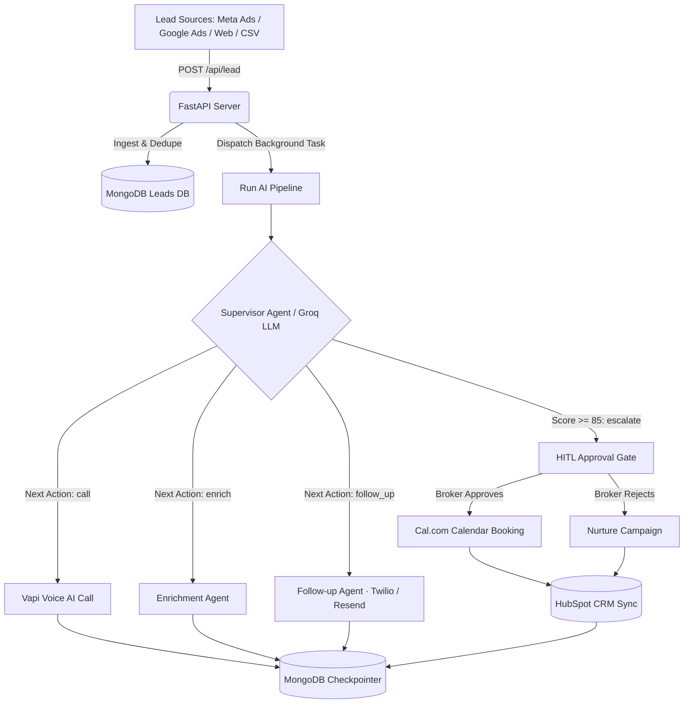

# 🏢 EstateX Agency AI — 60-Second Real Estate Lead Concierge & Pipeline Orchestrator

[](https://react.dev/)
[](https://fastapi.tiangolo.com/)
[](https://groq.com/)
[](https://www.mongodb.com/)
[](https://tailwindcss.com/)
[](LICENSE)

> **"Every lead you don't call in 5 minutes is someone else's client."**  
> EstateX turns web forms, Meta lead ads, and portal inquiries into booked property viewings instantly. Our AI Concierge calls leads back in under 60 seconds, qualifies buyers, and schedules qualified viewings straight onto your agency's calendar — 24/7.

---

## 📑 Table of Contents

- [Executive Overview](#-executive-overview)
- [Key Features](#-key-features)
- [System Architecture](#-system-architecture)
- [Tech Stack](#-tech-stack)
- [Getting Started](#-getting-started)
  - [Prerequisites](#1-prerequisites)
  - [Backend Setup](#2-backend-setup)
  - [Frontend Setup](#3-frontend-setup)
  - [Environment Variables](#4-environment-variables)
- [API Surface](#-api-surface)
- [Evaluation & Benchmarks](#-evaluation--benchmarks)
- [License](#-license)

---

## 🌟 Executive Overview

In real estate sales, speed-to-lead dictates conversion. Research shows that calling a lead within 5 minutes increases conversion odds by **21x**. However, human agents cannot respond instantly at all hours, filter out casual tire-kickers, or consistently update CRMs.

**EstateX** bridges this gap by deploying an autonomous voice and text AI Concierge (`Ava`) backed by a **LangGraph-style State Machine** with MongoDB checkpointing:

1. **Instant Callback (< 60s):** Initiates automated voice or SMS outreach upon lead capture.
2. **Deep Buyer Qualification:** Extracts intent (buy/rent/invest), budget range, timeline, financing status, and preferred neighborhoods.
3. **Automated Scoring & Routing:** Scores leads from 0–100 and routes them to `QUALIFIED`, `HOT`, `NURTURE`, or `BOOKED`.
4. **Human-in-the-Loop Escalations:** High-ticket leads (Score 85+) pause for human broker approval before executing critical actions.
5. **Seamless Tool Sync:** Direct integration with HubSpot CRM, Cal.com calendar booking, Twilio, and Resend.

---

## ✨ Key Features

### ⚡ 60-Second Lead Response
- **Multi-Channel Ingestion:** Webhook endpoints for Meta/Facebook Lead Ads, Google Search Ads, custom website forms, and bulk CSV/Excel uploads.
- **Voice Outreach:** Vapi voice AI integration for natural, human-like phone qualification.

### 🧠 Autonomous Qualification & Scoring
- **Groq LLM Engine:** Powered by `llama-3.3-70b-versatile` for sub-second structured JSON reasoning.
- **Explainable Scoring Rubric:** Objective score calculation based on financial readiness, urgency, and property fit.

### 🔄 LangGraph State Machine & Checkpointing
- **Persistent Memory:** `MongoCheckpointer` saves complete graph state per lead. Every agent interaction hydrates from the last checkpoint across days.
- **Deterministic Guardrails:** Illegal state transitions throw HTTP 400 to prevent race conditions and invalid pipeline states.

### 🤝 Human-in-the-Loop (HITL) Workflow
- **Broker Approval Gate:** HOT leads trigger an interrupt state. Brokers can `/approve` or `/reject` via single-click UI controls.

### 📊 Agency Command Center (Dashboard)
- **Live Kanban Board:** Real-time drag/status pipeline with live polling updates.
- **Search & Category Filters:** Search by lead name, phone, email, or area; filter by Hot, In Flight, Booked, or Approval Pending.
- **Bulk CSV/Excel Upload:** Instant file parsing and bulk dispatch to the AI pipeline.

---

## 📐 System Architecture



---

## 🛠️ Tech Stack

| Layer | Technologies |
| :--- | :--- |
| **Frontend** | React 19, Vite, Tailwind CSS, Phosphor Icons, Lucide React, Sonner |
| **Backend** | Python 3.11+, FastAPI (Async), Motor (MongoDB driver), Pydantic v2 |
| **AI / LLM** | Groq API (`llama-3.3-70b-versatile`), LangGraph-style micro-runtime |
| **Database** | MongoDB (Leads, Events, Checkpoints) |
| **Integrations** | Vapi (Voice), Cal.com (Booking), HubSpot (CRM), Twilio (SMS), Resend (Email) |
| **Testing** | pytest, pytest-xdist |

---

## 🚀 Getting Started

### 1. Prerequisites
- Python 3.11+
- Node.js 18+
- MongoDB instance (local or MongoDB Atlas)

### 2. Backend Setup

```bash
cd backend
python3 -m venv .venv
source .venv/bin/activate
pip install -r requirements.txt
```

Create a `.env` file in `backend/`:

```env
MONGO_URI=mongodb://localhost:27017
DB_NAME=estatex_db
GROQ_API_KEY=gsk_your_groq_api_key_here

# Optional Integrations
RESEND_API_KEY=re_your_resend_key
CAL_API_KEY=cal_live_your_cal_key
HUBSPOT_ACCESS_TOKEN=pat-na2-your_hubspot_token
TWILIO_ACCOUNT_SID=AC_your_twilio_sid
TWILIO_AUTH_TOKEN=your_twilio_token
TWILIO_PHONE_NUMBER=+14155550199
VAPI_API_KEY=vapi_your_key
```

Run the backend server:

```bash
uvicorn server:app --reload --port 8000
```

### 3. Frontend Setup

```bash
cd frontend
npm install
npm start
```

The app will open at `http://localhost:3000`.

---

## 🔌 API Surface

| Method | Path | Description |
| :--- | :--- | :--- |
| `POST` | `/api/lead` | Ingest a new lead and dispatch the AI pipeline |
| `POST` | `/api/leads/bulk` | Bulk import leads via CSV/Excel payload |
| `GET` | `/api/leads` | Retrieve all agency leads with qualification data |
| `GET` | `/api/leads/:id` | Fetch detailed lead history, transcript & supervisor trace |
| `POST` | `/api/leads/:id/approve` | Approve a human-in-the-loop escalation |
| `POST` | `/api/leads/:id/reject` | Reject an escalation and move lead to nurture |
| `POST` | `/api/seed` | Seed 15 demo agency leads and run qualification |
| `POST` | `/api/webhook/google` | Google Ads Lead Form extension webhook listener |

---

## 🧪 Evaluation & Benchmarks

Run the automated evaluation and test suite:

```bash
cd backend
source .venv/bin/activate
pytest -v
```

### Test Suite Benchmark Results

```text
================ 19 passed, 1 skipped in 27.18s ================
```

- ✅ **State Machine Legal Transitions:** 100% Guardrail Enforcement
- ✅ **Scoring Threshold Accuracy:** Verified 85+ (HOT), 70+ (QUALIFIED), <70 (NURTURE)
- ✅ **Opt-Out & Quiet Hours Compliance:** Verified
- ✅ **LangGraph Checkpoint Persistence:** Verified
- ✅ **Human-in-the-Loop Interrupt & Resume:** Verified

---

## 📄 License

Distributed under the MIT License. See `LICENSE` for details.
