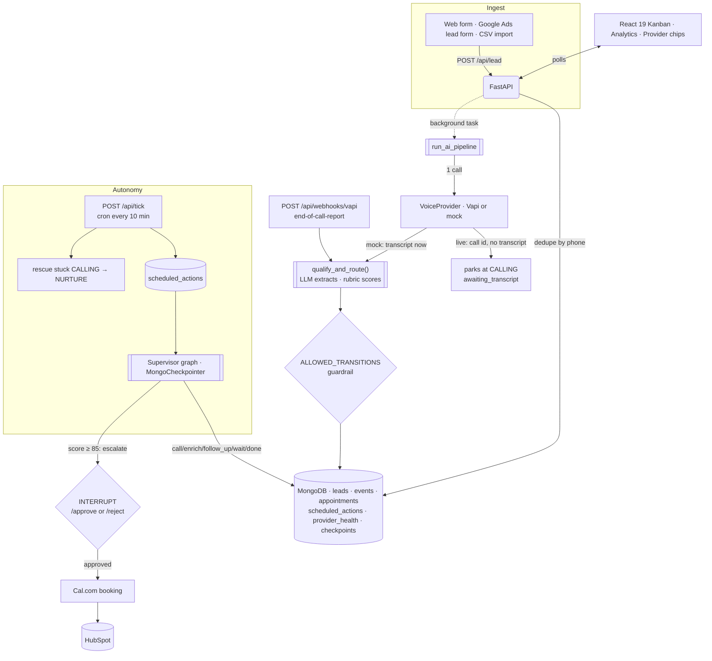

# 🏢 EstateX — 60-Second Real-Estate Lead Concierge

[](https://react.dev/)
[](https://fastapi.tiangolo.com/)
[](https://groq.com/)
[](https://www.mongodb.com/)
[](#-tests)
[](LICENSE)

> **"Every lead you don't call in 5 minutes is someone else's client."**

EstateX captures a real-estate lead, calls it back within seconds, qualifies the buyer into
structured fields, scores them 0–100 against an explainable rubric, routes them, books a
viewing, and follows up on its own schedule — with a human-approval gate on the leads worth
the most money.

**Design rule: the agent proposes, the state machine enforces.** The LLM extracts and
decides; scoring, transitions, CRM writes and booking commits are deterministic code.

---

## 📑 Contents

- [Run it in two minutes](#-run-it-in-two-minutes)
- [What is real and what is mocked](#-what-is-real-and-what-is-mocked)
- [Free-tier setup in ten minutes](#-free-tier-setup-in-ten-minutes)
- [Architecture](#-architecture)
- [How the autonomy actually works](#-how-the-autonomy-actually-works)
- [Security posture](#-security-posture)
- [API surface](#-api-surface)
- [Tests](#-tests)
- [Deploying](#-deploying)
- [Known limits](#-known-limits)
- [Further reading](#-further-reading)

---

## 🚀 Run it in two minutes

No API keys. No accounts. One MongoDB.

```bash
cd backend
python3 -m venv .venv && source .venv/bin/activate
pip install -r requirements.txt
cp .env.example .env          # MONGO_URL is the only value you must set
uvicorn server:app --reload --port 8000
```

```bash
cd frontend
npm install --legacy-peer-deps
npm start                     # http://localhost:3000
```

With `DEMO_MODE=1` (the default in `.env.example`) every provider runs a deterministic
mock: the call, the transcript, the slots, the email, the CRM write. A lead still travels
`NEW → CALLING → IN_CONVERSATION → QUALIFIED|HOT|NURTURE → BOOKED` with a real transcript,
a real score, and a real audit trail. Nothing external is contacted and nothing costs money.

Then set an `ADMIN_TOKEN` in `backend/.env`, click **Read-only** in the dashboard header,
paste it, and **Seed 15 Leads** to watch fifteen leads run the pipeline at once.

Health check: `curl localhost:8000/api/health`

---

## 🔍 What is real and what is mocked

Most demo projects hide this. Here it is a first-class feature: `GET /api/providers` reports
per-integration status and the dashboard renders it as a chip row — **grey = mocked,
green = live and healthy, amber = live but the last real call failed, with the HTTP status
on hover.**

| Provider | Unlocks | Free tier | Live with |
| :--- | :--- | :--- | :--- |
| **Groq** (`llama-3.3-70b-versatile`) | Qualification extraction + supervisor reasoning | Yes, no card | `GROQ_API_KEY` |
| **Resend** | Nurture + confirmation email | 100/day | `RESEND_API_KEY` (+ `DEMO_EMAIL`) |
| **Cal.com** | Real viewing slots and bookings | Yes | `CAL_API_KEY`, `CAL_EVENT_TYPE_ID` |
| **HubSpot** | Contact upsert + associated deal | Yes | `HUBSPOT_ACCESS_TOKEN` |
| **Twilio** | Follow-up SMS + inbound `STOP` | Trial, but US A2P 10DLC approval takes days | keys **and** `SMS_ENABLED=1` |
| **Vapi** | Outbound AI phone calls | No — needs a funded account and a number | keys **and** `VOICE_ENABLED=1` |

Every provider call returns a `ProviderResult` (`provider, mode, ok, status, error, data`)
which is written to `db.provider_health` and to the lead's event log. Three consequences
worth knowing:

- **A failed live call is never reported as a success.** A Cal.com booking that returns 500
  makes `POST /leads/:id/book` return **502** and leaves the lead's status untouched. A
  HubSpot 409 is a recorded failure, not `{"ok": true}`.
- **A live failure falls back to the mock as a separate, separately-recorded result**, so
  the audit log never shows a send that did not happen.
- **Qualification never runs on an empty transcript.** With Vapi live, `start_call` returns
  a call id and no transcript; the lead parks at `CALLING` with `awaiting_transcript` until
  Vapi POSTs its end-of-call report. Scoring an empty transcript would produce a confident
  `0 / NURTURE` for a lead the AI never actually spoke to.

---

## 🔑 Free-tier setup in ten minutes

Add keys one at a time to `backend/.env` and set `DEMO_MODE=0`. Each block is independent;
anything you leave blank stays mocked. Full annotations live in
[`backend/.env.example`](backend/.env.example).

**1. MongoDB Atlas — free M0** · [cloud.mongodb.com](https://cloud.mongodb.com)
Create a cluster, add a database user, allow `0.0.0.0/0` for the demo, copy the
`mongodb+srv://…` string into `MONGO_URL`. (The driver pins certifi's CA bundle, so TLS
works on hosts that ship no system trust store.)

**2. Groq — free, no card** · [console.groq.com/keys](https://console.groq.com/keys)
`GROQ_API_KEY=gsk_…`. Verify: `qualification.reasoning` becomes a real sentence instead of
`"Fallback extraction (LLM unavailable)."`, and `GET /api/eval` flips `baseline_only` to
`false`.

**3. Resend — 100 emails/day** · [resend.com/api-keys](https://resend.com/api-keys)
`RESEND_API_KEY=re_…`, keep `FROM_EMAIL=onboarding@resend.dev` until you verify a domain,
and set `DEMO_EMAIL` to your own inbox — seeded leads use `@example.com` addresses that can
never deliver, and Resend's 403 for an unverified domain would otherwise be the only thing
you learn.

**4. Cal.com** · [app.cal.com/settings/developer/api-keys](https://app.cal.com/settings/developer/api-keys)
`CAL_API_KEY` + `CAL_EVENT_TYPE_ID`. Verify: `GET /api/leads/:id/slots` returns real
availability. Then verify the failure path too — a bad event type must **not** mark a lead
`BOOKED`.

**5. HubSpot private app** · [developers.hubspot.com/docs/api/private-apps](https://developers.hubspot.com/docs/api/private-apps)
Scopes `crm.objects.contacts.write` + `crm.objects.deals.write` → `HUBSPOT_ACCESS_TOKEN`.
Contacts are upserted on `email`, so running the pipeline twice updates rather than 409s,
and the deal is associated to the contact instead of orphaned.

**6. Optional — Twilio** (`SMS_ENABLED=1`) and **Vapi** (`VOICE_ENABLED=1`). Both are fully
wired; both are off by default because a present key is not the same as a working channel.
For Vapi, point the assistant's server URL at `POST /api/webhooks/vapi` and set
`VAPI_WEBHOOK_SECRET` to match the `x-vapi-secret` header.

---

## 📐 Architecture



**Two loops, on purpose.** `run_ai_pipeline` is the fast path — capture to qualified in
about two seconds. The supervisor graph is the slow path: it hydrates the full history from
`db.graph_checkpoints`, picks a next-best action, and can span days. They meet in
`qualify_and_route()`, the single code path shared by the mock pipeline and the live Vapi
webhook.

**Scoring is deliberately not the LLM's job.** The LLM extracts five fields; the rubric in
`_fallback_score` scores them (intent 25 · budget 25/15 · timeline 20/5 · financing 15 ·
area 15). Explainable, reproducible, and unit-testable — and when no LLM is configured the
same rubric runs over question-aware keyword extraction, so the demo degrades instead of
breaking.

---

## ⏱ How the autonomy actually works

There is no Celery, no Redis, no worker fleet. There is one collection and one endpoint.

`db.scheduled_actions` = `{lead_id, kind, run_at, payload, state, attempts, error}`.
Anything that needs to happen later is a row: the supervisor's `wait` action, a follow-up
deferred because it landed inside quiet hours, a retry after a failed live call.

`POST /api/tick` is one idempotent pass:

1. **Drain** every `PENDING` row with `run_at <= now` — run the supervisor, or send the
   notification that quiet hours held back.
2. **Rescue** leads stranded in `CALLING`/`IN_CONVERSATION` past `CALL_TIMEOUT_MINUTES` with
   no transcript — record `call.timeout` and transition to `NURTURE`. This is the safety net
   for a dropped webhook or a host that froze mid-background-task.
3. **Requalify** leads whose transcript arrived but whose qualification never ran.
4. Return a summary of exactly what it did — which makes the response a demo artifact.

Rows are claimed with a conditional update (`{state: "PENDING"} → "RUNNING"`, skip if
`modified_count == 0`), so two overlapping ticks cannot run the same action twice.

[`.github/workflows/tick.yml`](.github/workflows/tick.yml) curls it every 10 minutes, which
also keeps a free-tier Render instance from spinning down. One mechanism, two jobs.

Try it: `curl -X POST localhost:8000/api/tick -H "X-Admin-Token: $ADMIN_TOKEN"`

---

## 🔒 Security posture

- **Write routes fail closed.** `POST /api/seed`, `/api/simulate`, `/api/leads/bulk`,
  `/api/tick` and `DELETE /api/reset` require `X-Admin-Token`. They return **401 when
  `ADMIN_TOKEN` is unset**, not "allow everything" — comparison is `secrets.compare_digest`.
- **The public deploy is read-only.** Browsing leads, detail, analytics and the funnel needs
  no token; seed/import/reset are visibly disabled with a tooltip until one is entered. The
  token lives in `localStorage` and is never bundled.
- **Per-IP rate limit** on the public `POST /api/lead` (`LEAD_RATE_LIMIT_PER_MIN`, default
  10/min) so the capture form cannot run up an LLM bill.
- **`GOOGLE_LEADS_WEBHOOK_KEY` has no default** — the webhook returns 503 while it is unset
  and 401 on mismatch. Vapi and Twilio webhooks verify a shared secret and are idempotent on
  the provider's message id (`db.webhook_receipts`).
- **Compliance is enforced in one place.** `send_notification` blocks opted-out leads and
  defers anything inside quiet hours (`QUIET_HOURS_*`, UTC). Inbound `STOP`/`UNSUBSCRIBE`
  sets `opted_out` for good.
- **No import-time crash.** A missing `MONGO_URL` produces a clear error from
  `GET /api/health`, not an opaque 500 from an app that never booted.

---

## 🔌 API surface

| Method | Path | Purpose |
| :--- | :--- | :--- |
| `GET` | `/api/health` | DB reachability, demo mode, quiet-hours state, provider modes |
| `GET` | `/api/providers` | Per-provider mode + last real call outcome (drives the chips) |
| `POST` | `/api/lead` | Capture (dedupe by phone, rate-limited) + dispatch the pipeline |
| `POST` | `/api/leads/bulk` 🔒 | CSV/Excel bulk import |
| `POST` | `/api/webhooks/google-leads` | Google Ads lead form (key-verified) |
| `POST` | `/api/webhooks/vapi` | `end-of-call-report` → transcript → qualification |
| `POST` | `/api/webhooks/twilio-sms` | Inbound SMS; `STOP` opts out. Returns TwiML |
| `GET` | `/api/leads` · `/api/leads/:id` | List / detail with transcript + qualification |
| `GET` | `/api/leads/:id/events` | Append-only audit log |
| `GET` | `/api/leads/:id/scheduled` | Pending future work for this lead |
| `GET` | `/api/leads/:id/slots` · `POST` `/book` | Availability / booking (502 on provider failure) |
| `POST` | `/api/leads/:id/supervisor` | Run the supervisor graph, returns its reasoning trace |
| `POST` | `/api/leads/:id/approve` · `/reject` | Resume the graph from its approval interrupt |
| `GET` | `/api/leads/:id/checkpoint` | Inspect saved graph state |
| `POST` | `/api/leads/:id/rerun` · `/opt-out` | Re-dispatch (through the state machine) / suppress |
| `POST` | `/api/tick` 🔒 | One autonomy pass; returns what it did |
| `GET` | `/api/analytics` · `/api/eval` | Funnel KPIs (single `$group`) / rubric agreement |
| `POST` | `/api/seed` · `/api/simulate` 🔒 · `DELETE` `/api/reset` 🔒 | Demo data management |

🔒 = requires `X-Admin-Token`.

---

## 🧪 Tests

```bash
cd backend
pytest
```

```text
======================= 69 passed, 113 warnings in 1.47s =======================
```

**No server, no database, no network, no extra installs.** `tests/conftest.py` provides a
stdlib-only in-memory stand-in for the slice of Motor the app uses and calls the async
endpoint functions directly. It raises `NotImplementedError` on any query operator it does
not implement, so an unsupported query fails loudly instead of returning an empty result.

Covered, among others: the full legal-transition map; all five mock buyer profiles landing
on their expected score bands (including one that scores exactly 100/HOT); a live call
parking at `CALLING` with `qualification is None`; `409` when qualification is attempted on
an empty transcript; concurrent ticks unable to double-run an action; stuck-call rescue; a
failed booking returning 502 with the lead status unchanged and no appointment row; a live
notification failure recorded *before* the mock fallback; the `require_admin` 401 matrix;
the per-IP rate limit; quiet-hours defer-then-send; Twilio `STOP` and webhook idempotency.

`tests/test_v2_api.py` is the HTTP integration suite. It needs a running server and is
marked `integration`, so it is deselected by default:

```bash
uvicorn server:app --port 8000        # one shell
pytest -m integration -n 0            # another
```

---

## 🌐 Deploying

**Backend → Render (free), frontend → Vercel (free).** The backend needs a process that is
alive between requests: it finishes the pipeline after the response is sent, and the tick
loop has to run on a schedule. A frozen serverless container strands leads in `CALLING`.

1. Render → **New → Blueprint** → this repo. [`render.yaml`](render.yaml) creates the
   service (root `backend`, `uvicorn server:app --host 0.0.0.0 --port $PORT`, health check
   `/api/health`), generates `ADMIN_TOKEN`, and prompts for `MONGO_URL` and `CORS_ORIGINS`.
2. Vercel → import the repo. [`vercel.json`](vercel.json) builds the SPA only
   (`framework: null`, because the build is `craco build`). Set
   `REACT_APP_BACKEND_URL=https://your-service.onrender.com`.
3. GitHub → **Settings → Secrets and variables → Actions**: variable `BACKEND_URL`, secret
   `ADMIN_TOKEN`. The tick workflow no-ops without both, so forks stay green.

Free instances sleep after ~15 minutes idle (~50s cold start); the 10-minute tick keeps it
warm. Nothing is Render-specific beyond `render.yaml` — Railway and Fly.io are drop-in.

---

## ⚠️ Known limits

Stated plainly, because an honest limits section is worth more than a feature list.

- **The tick's resolution is its cron interval.** A follow-up due at 09:03 fires on the next
  run after that, and GitHub delays scheduled workflows under load. Fine for follow-ups,
  wrong for anything second-sensitive.
- **A failed scheduled action is marked `FAILED` and not retried.** The row keeps its error
  for inspection; there is no exponential backoff.
- **The rate limit is per-process and in-memory** — it resets on deploy and does not
  coordinate across instances. Correct fix at scale is Redis or the edge.
- **`GET /api/eval` measures rubric agreement, not ground truth.** With no LLM key it is
  comparing the deterministic extractor against itself, which is why the response carries an
  explicit `baseline_only` flag rather than a flattering accuracy number.
- **The supervisor graph is a purpose-built 139-line runtime**
  ([`backend/agents/graph.py`](backend/agents/graph.py)), not LangGraph. It implements the
  parts this product needs — Mongo checkpointing, interrupt/resume, a bounded loop — and
  nothing else.
- **Single-tenant.** One admin token, no per-agency isolation, no user accounts.

---

## 📚 Further reading

- [`docs/PRD.md`](docs/PRD.md) — problem, personas, everything that shipped, everything still
  on the backlog.
- [`backend/README.md`](backend/README.md) — the agent layer up close: state machine,
  checkpointing, the human-in-the-loop interrupt, the scoring rubric.
- [`backend/.env.example`](backend/.env.example) — every environment variable, annotated with
  what it unlocks and what happens when it is absent.

---

## 📄 License

MIT. See `LICENSE`.
