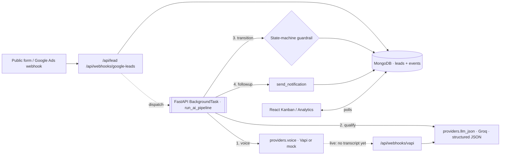

# AI Real-Estate Lead Qualifier

A full-stack platform that captures real-estate leads, contacts them within minutes with an
AI agent, qualifies them into structured data with a 0-100 score, books appointments on a
calendar, runs follow-ups, and uses a **LangGraph-style supervisor agent** to decide the
next-best action per lead over time.

**Stack:** FastAPI (async) · MongoDB (Motor) · React 19 · Tailwind + shadcn/ui · Groq LLM (llama-3.3-70b-versatile) · custom LangGraph-style supervisor with MongoDB
checkpointing.

---

## Design rule

> **The agent proposes, the state machine enforces.**
> Agentic: qualification, next-best-action, adaptive follow-up, enrichment.
> Deterministic: CRM writes, booking commits, state-transition validation.

## Lead state machine

```
NEW ──▶ CALLING ──▶ IN_CONVERSATION ──▶ QUALIFIED ──▶ BOOKED
                                    ├─▶ HOT ────────▶ BOOKED
                                    └─▶ NURTURE
```

Every transition is validated against `ALLOWED_TRANSITIONS` in `server.py` and written to
the `events` audit log with a correlation id.

## V1 architecture — automation



Both the mock path and the webhook path converge on `qualify_and_route(lead_id)` — one code
path, so the live integration can't drift from the demo. A live call with no transcript yet
parks the lead at `CALLING` with `awaiting_transcript=True`; qualification never runs on an
empty transcript.

## V2 architecture — LangGraph supervisor

```mermaid
flowchart LR
  invoke["/api/leads/:id/supervisor"] --> load[load_history]
  load --> sup[[supervisor · LLM decides next_action]]
  sup -->|call| call[call action]
  sup -->|enrich| enr[[enrichment_agent · LLM]]
  sup -->|follow_up| fol[[followup_agent · LLM · quiet hours + opt-out]]
  sup -->|escalate| esc[escalate]
  sup -->|wait| wait[schedule_next_check]
  sup -->|done| done[done]
  esc -.INTERRUPT.-> approve{"/approve or /reject"}
  approve -.resume.-> esc
  call & enr & fol & esc & wait & done --> cp[(MongoCheckpointer · state per lead_id)]
```

**Sub-agents**
- `supervisor_node` — LLM (Groq `llama-3.3-70b-versatile`, via `providers.llm_json`) picks `next_action ∈ {call, enrich, follow_up, escalate, wait, done}` with reasoning; deterministic rule-based fallback if the LLM is unavailable.
- `enrichment_agent` — LLM produces area brief + a persuasive hook; persisted on the lead.
- `followup_agent` — LLM drafts channel/tone/subject/body/defer_hours; delegates to `NotificationProvider` (which enforces quiet hours + opt-out).

**Checkpointing**
`MongoCheckpointer` writes the full graph state to `db.graph_checkpoints` keyed by
`lead_id`. Every invocation hydrates from the last checkpoint — the agent has memory
across days.

**Human-in-the-loop**
`escalate` node returns `{_interrupt: True}` on first entry. The engine saves state and
returns. `/api/leads/:id/approve` or `/reject` re-invokes `ainvoke(resume=True)`, which
re-enters the same node with `approved=True|False` in state.

## API surface (selected)

| Method | Path | Purpose |
|---|---|---|
| POST | `/api/lead` | Capture lead (dedupe by phone, per-IP rate limit) + dispatch AI pipeline |
| POST | `/api/webhooks/google-leads` | Google Ads Lead Form webhook (verify `google_key`; 503 when unconfigured) |
| POST | `/api/webhooks/vapi` | `end-of-call-report` → transcript → `qualify_and_route` |
| POST | `/api/webhooks/twilio-sms` | Inbound SMS; `STOP` opts out. Returns TwiML |
| GET | `/api/leads`, `/api/leads/:id`, `/api/leads/:id/events` | List / detail / audit log |
| GET | `/api/leads/:id/slots` · POST `/book` | Cal.com availability / booking (502 if the provider fails) |
| GET | `/api/leads/:id/scheduled` | Queued future work for this lead |
| POST | `/api/leads/:id/supervisor` | Run V2 supervisor graph |
| POST | `/api/leads/:id/approve` · `/reject` | Resume graph from human-approval interrupt |
| POST | `/api/leads/:id/opt-out` | Block further notifications |
| GET | `/api/leads/:id/checkpoint` | Inspect saved graph state |
| POST | `/api/tick` 🔒 | One autonomy pass: drain due actions, rescue stuck calls, requalify |
| GET | `/api/health` · `/api/providers` | DB + provider diagnostics; per-provider last-call outcome |
| POST | `/api/seed` · `/simulate` 🔒 | Seed 15 demo leads / run eval simulation |
| GET | `/api/eval` | Rubric agreement + booking rate + hallucination proxy |
| GET | `/api/analytics` | Funnel + KPIs (single `$group`) |
| DELETE | `/api/reset` 🔒 | Wipe everything |

🔒 = requires `X-Admin-Token`; returns 401 when `ADMIN_TOKEN` is unset.

## Scheduler

`db.scheduled_actions` holds anything that must happen later — the supervisor's `wait`,
a notification held for quiet hours, a retry after a failed live call. `POST /api/tick`
drains what is due, rescues leads stranded in `CALLING` past `CALL_TIMEOUT_MINUTES`, and
requalifies leads whose transcript arrived but whose scoring never ran. Rows are claimed
with a conditional `PENDING → RUNNING` update, so overlapping ticks can't double-run one.
`.github/workflows/tick.yml` calls it every 10 minutes.

## Quiet hours + opt-out

`send_notification()` checks:
1. `lead.opted_out == True` → block and record event.
2. Current UTC hour ∈ `[QUIET_HOURS_START, QUIET_HOURS_END)` (default 21:00-08:00) → enqueue
   a `notify` row in `scheduled_actions` for the end of quiet hours; the next tick sends it.
3. Otherwise → send. A LIVE failure is recorded as an `error` result *before* the mock
   fallback runs, so the audit log never shows a send that didn't happen.

## Correlation logging

Every log line carries `[lead=<id>]` via a custom `Formatter`, so grepping the log by a
single lead_id gives a linear trace of its full journey.

## Evaluation

```
POST /api/simulate            # runs 15 scripted leads through the pipeline
sleep 20                       # wait for LLM qualification
GET  /api/eval                 # {rubric_agreement, booking_rate, hallucination_rate, baseline_only}
```

Ground truth is derived from each lead's own transcript, not a hardcoded answer key. With no
LLM key configured the extractor is being compared against itself, which the response says
outright via `baseline_only: true`.

The hallucination proxy compares LLM-extracted budget/area/timeline against the
transcript text — cheap but effective for catching invented values.

## Tests

```
cd backend && pytest
```

69 tests, ~1.5s, no server / database / network — `tests/conftest.py` swaps in a stdlib
in-memory double for the slice of Motor the app uses. `tests/test_v2_api.py` is the HTTP
integration suite, marked `integration` and deselected by default.

## Providers — one env var flips mock to live

All external services live in `providers.py` behind `PROVIDER_SPECS`: a provider is LIVE
when its env vars are present (and its `gate` is open, for Twilio/Vapi), MOCK otherwise, and
always MOCK under `DEMO_MODE=1`. Every method returns a `ProviderResult`
(`provider, mode, ok, status, error, data`) which is recorded in `db.provider_health` and in
the lead's event log — so `GET /api/providers` and the dashboard chips report the outcome of
the last real call rather than a hardcoded "connected".
