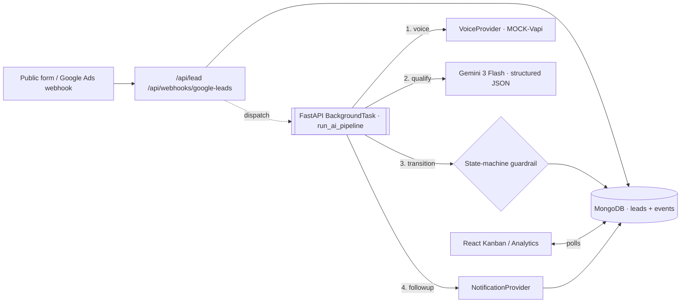

# AI Real-Estate Lead Qualifier

A full-stack platform that captures real-estate leads, contacts them within minutes with an
AI agent, qualifies them into structured data with a 0-100 score, books appointments on a
calendar, runs follow-ups, and uses a **LangGraph-style supervisor agent** to decide the
next-best action per lead over time.

**Stack:** FastAPI (async) · MongoDB (Motor) · React 19 · Tailwind + shadcn/ui · Groq LLM (llama-3.3-70b-versatile) · custom LangGraph-style supervisor with MongoDB
checkpointing.

---

## Design rule

> **The agent proposes, the state machine enforces.**
> Agentic: qualification, next-best-action, adaptive follow-up, enrichment.
> Deterministic: CRM writes, booking commits, state-transition validation.

## Lead state machine

```
NEW ──▶ CALLING ──▶ IN_CONVERSATION ──▶ QUALIFIED ──▶ BOOKED
                                    ├─▶ HOT ────────▶ BOOKED
                                    └─▶ NURTURE
```

Every transition is validated against `ALLOWED_TRANSITIONS` in `server.py` and written to
the `events` audit log with a correlation id.

## V1 architecture — automation



## V2 architecture — LangGraph supervisor

```mermaid
flowchart LR
  invoke["/api/leads/:id/supervisor"] --> load[load_history]
  load --> sup[[supervisor · LLM decides next_action]]
  sup -->|call| call[call action]
  sup -->|enrich| enr[[enrichment_agent · LLM]]
  sup -->|follow_up| fol[[followup_agent · LLM · quiet hours + opt-out]]
  sup -->|escalate| esc[escalate]
  sup -->|wait| wait[schedule_next_check]
  sup -->|done| done[done]
  esc -.INTERRUPT.-> approve{"/approve or /reject"}
  approve -.resume.-> esc
  call & enr & fol & esc & wait & done --> cp[(MongoCheckpointer · state per lead_id)]
```

**Sub-agents**
- `supervisor_node` — LLM (Gemini 3 Flash) picks `next_action ∈ {call, enrich, follow_up, escalate, wait, done}` with reasoning; deterministic fallback if LLM fails.
- `enrichment_agent` — LLM produces area brief + a persuasive hook; persisted on the lead.
- `followup_agent` — LLM drafts channel/tone/subject/body/defer_hours; delegates to `NotificationProvider` (which enforces quiet hours + opt-out).

**Checkpointing**
`MongoCheckpointer` writes the full graph state to `db.graph_checkpoints` keyed by
`lead_id`. Every invocation hydrates from the last checkpoint — the agent has memory
across days.

**Human-in-the-loop**
`escalate` node returns `{_interrupt: True}` on first entry. The engine saves state and
returns. `/api/leads/:id/approve` or `/reject` re-invokes `ainvoke(resume=True)`, which
re-enters the same node with `approved=True|False` in state.

## API surface (selected)

| Method | Path | Purpose |
|---|---|---|
| POST | `/api/lead` | Capture lead (dedupe by phone) + dispatch AI pipeline |
| POST | `/api/webhooks/google-leads` | Google Ads Lead Form webhook (verify `google_key`) |
| GET | `/api/leads`, `/api/leads/:id`, `/api/leads/:id/events` | List / detail / audit log |
| GET | `/api/leads/:id/slots` · POST `/book` | Booking (mock Cal.com) |
| POST | `/api/leads/:id/supervisor` | Run V2 supervisor graph |
| POST | `/api/leads/:id/approve` · `/reject` | Resume graph from human-approval interrupt |
| POST | `/api/leads/:id/opt-out` | Block further notifications |
| GET | `/api/leads/:id/checkpoint` | Inspect saved graph state |
| POST | `/api/seed` · `/simulate` | Seed 15 demo leads / run eval simulation |
| GET | `/api/eval` | Qualification accuracy + booking rate + hallucination proxy |
| GET | `/api/analytics` | Funnel + KPIs |
| DELETE | `/api/reset` | Wipe everything |

## Quiet hours + opt-out

`NotificationProvider.send()` checks:
1. `lead.opted_out == True` → block and record event.
2. Current UTC hour ∈ `[QUIET_HOURS_START, QUIET_HOURS_END)` (default 21:00-08:00) → defer with `deferred_until` timestamp.
3. Otherwise → send normally.

## Correlation logging

Every log line carries `[lead=<id>]` via a custom `Formatter`, so grepping the log by a
single lead_id gives a linear trace of its full journey.

## Evaluation

```
POST /api/simulate            # runs 15 scripted leads through the pipeline
sleep 20                       # wait for LLM qualification
GET  /api/eval                 # {qualification_accuracy, booking_rate, hallucination_rate}
```

The hallucination proxy compares LLM-extracted budget/area/timeline against the
transcript text — cheap but effective for catching invented values.

## Tests

```
cd /app/backend && pytest tests/ -v
```

Covers state-machine legal-transitions map + scoring rubric edge cases.

## Providers — swap real for mock in one line

All external services are behind small interface classes
(`VoiceProvider`, `BookingProvider`, `NotificationProvider`, `CRMProvider`). To wire
real Vapi / Cal.com / Twilio / Resend / HubSpot, replace the class body — the state
machine, graph, and UI don't change.
